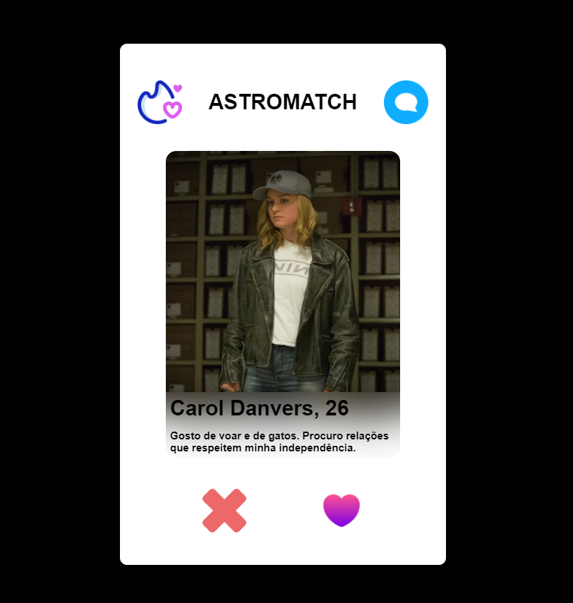

<h2 align="center">
     
    
🚀 Projeto Astromatch

</h2>

<h1>Resumo</h1>

    projeto com o objetivo de fazer um clone do Tinder: o Astromatch.

- Esse projeto foi todo construido com React e foi possivel aprender algumas lições muito importantes sobre alguns Hooks como useState e useEffect ao longo do projeto, além do uso de uma API para passar os dados dos perfis.

<h2>
    
⭐ Requisitos do Projeto

</h2>

O projeto consiste em 3 partes:

 

1. Tela inicial

- Ao entrar na aplicação, o usuário deve ser capaz de ver uma opção de perfil para escolher. Devem ser mostrados a foto, o nome e a descrição dos perfis. Dois botões devem estar na tela: um que permita "dar *match*" (uma escolha "positiva") e o outro que permita descartar a sugestão (uma escolha "negativa"). Por fim, deve existir um botão que leve para a tela de matches.

2. Tela de matches

- Essa tela é constituída de uma lista de usuários que "deram match" com o usuário que estiver usando a nossa aplicação. Devem ser mostradass as fotos e os nomes dos perfis. 

3. Possibilidade de resetar

- O usuário da nossa aplicação pode limpar as informações dos matches que deram a qualquer momento em qualquer tela do site. Para isso, adicione um botão que fique bem claro que faz isso (com uma mensagem ou um ícone pertinente)

 

## Web

     
     

<h2>
     
    
🔗 Link Surge

</h2>

➡ https://uncovered-nose.surge.sh/

 

## 🛠️ Construído com

 

 

